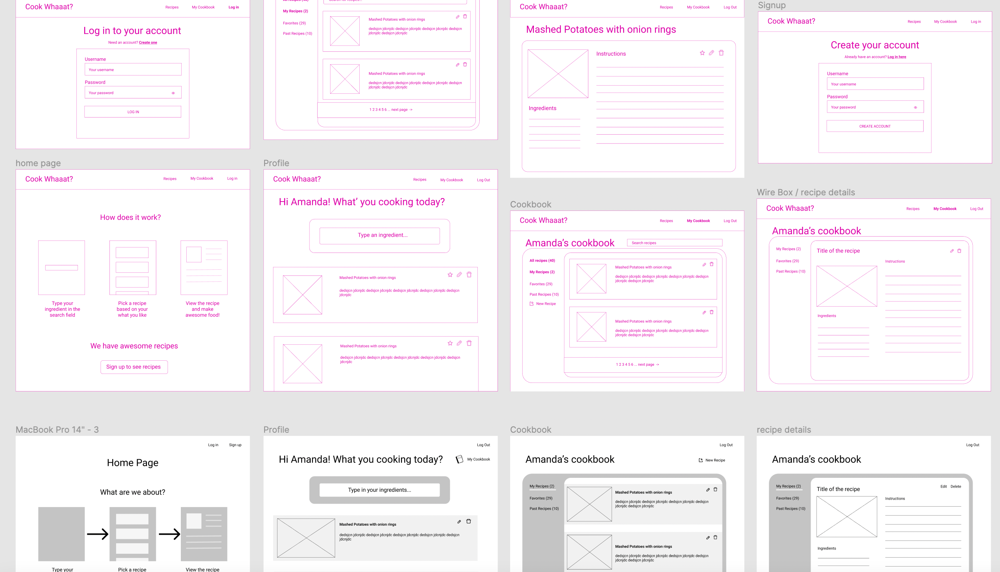
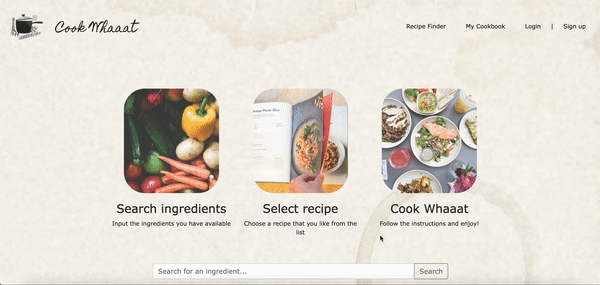

# COOK WHAAAT (Ironhack-project-2)


Have you ever looked at your fridge and thought:  ‘I only have potatoes! What now?’. We’re here to save the day! With our app you can search for recipes containing the ingredients you have in your fridge. You also get a personalised cookbook to create and save your favorite recipes.
Try all that and more on https://cook-whaaat.herokuapp.com/cookbook


## Motivation

This project was done as part of the Ironhack full time web development bootcamp. It is the second out of three main projects required to finish the bootcamp. The reason Cook-Whaaat was chosen is because it matches exactly the criteria of the requirements and because we wanted to help people be creative with their everyday ingredients to decrease food waste


## Features

### Find recipes:

1. Type in the homepage the ingredients you have available
2. Search through the recipe list and find a recipe you like
3. Cook it and enjoy :)

### Cookbook:

Allows you to have all your recipes in one place!
1. You can create, edit, delete your own recipes
2. You can add recipes to your favorites list
3. All that is contained within your profile, so make sure you sign up


## Development process

### Wireframing

The project was started by creating wireframes to draw out the concept, as well as define the UI. There was more than one phase of design where we came back and edited the concept. Below you can see some of the sketches:


### Project backlog

The project was divided into 4 epics: User Profile, Cookbook, Recipe finder and miscellaneous. Below you can see a sample of the initial backlog:

- **User Profile (model)**
1. As a user role I need to input my username in a form input field and input a valid password to log into my cookbook  (login)
2. As a user role I need to click a button to log out of my cookbook (logout)
3. As a user role I need to input a valid username and password to create an account (sign up)

- **Cookbook**
1. As a user role I need to fill in specific information about a recipe and press ‘create’  to create new recipes in my cookbook  (create recipe in cookbook)
2. As a user role I want to click on ‘see recipe’ to see details of that recipe (see details of recipe in cookbook)
3. As a user role I need to click on ‘edit’ to  edit an existing recipe in my cookbook and click ‘save’ to save changes and return to the list of all recipes (update recipe in cookbook)
4. As a user role I want to press ‘delete’ to remove a recipe from my cookbook (delete recipe in cookbook)
5. As a user role I want to see a list of all the recipes in my cookbook by pressing on the ‘recipes’ button (overview of recipes in cookbook)

- **Recipes (model)**
1. As a user role I want to input the name of an ingredient in the search field and get a list of all recipes with the ingredients I have inputted (partials for recipe cards + view of search engine all recipes)
2. As a user role I want to see a list of all the recipes in the whole system by pressing on the ‘recipes’ button  (PARTIAL  - detail page - recipe)

- **Miscellaneous**
1. Github repo (create all folders and files)
2. layout: navbar footer etc.
3. ironlauncher
5. find a data source
4. create a mock database

- **Nice to have**
There was also a few items that we wanted to add if time allowed: edit/delete user, passport login with social media, copy clone update recipe to cookbokk


## Future features

- Improve responsiveness of the website
- Testing and potential bugfixing
- fix formatting on instructions list
- Profile page for editing and deleting users
- Implement Passport and add login with social media
- Clone a database recipe so it can be updated by the user to their liking
- Search multiple ingredients
- Add pagination when loading multiple recipes
- Improve "add to favorites" functionality
- If no search results found, return a message to the user


## Models

There are two models used, the user Model and the Recipe model.

### User Model

```
`{
`    username: {
`      type: String,
`      trim: true,
`      required: [true, "Username is required."],
`      unique: true,
`    },
`    passwordHash: {
`      type: String,
`      required: [true, "Password is required."],
`    },
`    createdRecipes: [{ type: Schema.Types.ObjectId, ref: "Recipe" }],
`    favoriteRecipes: [{ type: Schema.Types.ObjectId, ref: "Recipe" }],
`  },
`  {
`    timestamps: true,
`  }
```

The created recipes and favorite recipes hold the ID of recipes that the user created or added to favorites respectively. It's used to generate relevant content on certain pages.

### Recipe Model

```
`const recipeSchema = new Schema(
`  {
`    title: {
`      type: String,
`      trim: true,
`      required: [true, "title is required."],
`      unique: true,
`    },
`    ingredients: {
`      type: String,
`      trim: true,
`      required: [true, "Ingredients are required."],
`      unique: true,
`    },
`    instructions: {
`      type: String,
`      trim: true,
`      required: [true, "Instructions are required."],
`      unique: true,
`    },
`    imageUrl: {
`      type: String,
`      trim: true,
`      required: [true, "Image is required."],
`      unique: true,
`    },
`    creator: { type: String, required: [true, "creator is required."] },
`  },
`  {
`    timestamps: true,
`  }
`);
```


## Server routes table

| Route                      | HTTP Verb | Description                                                        |
|----------------------------|-----------|--------------------------------------------------------------------|
| /cookbook/                 | Get       | renders to the cookbook page                                       |
| /                          | Get       | redirects to /recipes/                                             |
| /recipes/                  | Get       | renders recipe finder page (home page)                             |
| /recipes/search/           | Post      | renders recipe results within the recipe finder page               |
| /recipes/create/           | Post      | creates a new recipe in the database                               |
| /recipes/favorites/        | Post      | add recipe to favorites                                            |
| /recipes/favoritesRemove/  | Post      | removes recipe from favorites                                      |
| /recipes/:recipeId/        | Get       | renders recipe details (only user created recipes)                 |
| /recipes/:recipeId/edit/   | Get       | renders edit page for a certain recipe (only user created recipes) |
| /recipes/:recipeId/edit/   | Post      | updates the edited recipe (only user created recipes)              |
| /recipes/:recipeId/delete/ | Post      | deletes a recipe from the database (only user created recipes)     |
|                            |           |                                                                    |


## Build status

The website hasn't undergone a lot of testing so it might contain some bugs.


## Frameworks, libraries and technologies used

- Built using HTML, CSS, JS: Node.js, Handlebars, Express, jQuery
- Bcrypt to support with authentication
- Cloudinary to host the recipe images
- Database: MongoDB for local testing, and Mongo Atlas for production
- Git for distributed version control, and GitHub for source code management and hosting
- Heroku for hosting the application


## Demo



## Special thanks

Thanks to [Raymond](https://github.com/RaymondMaroun) and [Joana](https://github.com/jofariaironhack) for their guidance and support throughout the bootcamp and this project.


## Team members
Created by [Amanda](https://github.com/amandaCiliberto) and [Mohammed](https://github.com/MohammedCh).
